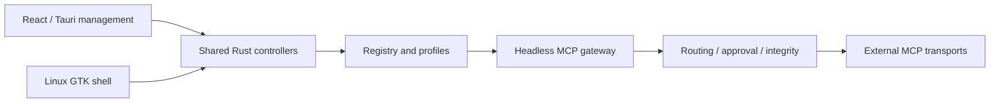

# Toolport source overview

Source reference: commit `c5182707a1a744e3e684d22124e7dbd33aee1e68`. The diagram and links describe this revision; they are navigation rather than runtime qualification.

Toolport combines a React/Tauri management interface, a distinct Linux GTK shell and a headless Rust MCP gateway. Both management shells use shared controllers and registry/policy behavior, while their presentation and platform lifecycle differ.

The React interface uses local Geist Variable, semantic Tailwind/shadcn tokens, an orange brand/action accent and light, dark or system themes. The GTK shell follows the Omarchy palette; this is a separate native theme contract.

## Views and platform boundaries

The React view union includes Servers, Clients, Activity, Catalog, Playground, Rules, Hooks, Permissions, Teams and Settings. Server row status distinguishes disabled, checking, connected, authentication required and error from enablement and probe results. Activity renders call and security observations supplied by the backend.

The Linux-native guide and parity inventory describe the GTK shell, package-managed updates and intentional differences. The README hero is a native Linux Tokyo Night capture, as identified by the screenshot inventory. A React browser fixture does not establish GTK, keychain, OAuth or gateway acceptance.

## Source references

- [React entry](../src/main.tsx)
- [React composition](../src/App.tsx)
- [Server row](../src/components/RegistryServerRow.tsx)
- [Activity](../src/components/ActivityView.tsx)
- [React theme](../src/lib/theme.tsx)
- [Linux-native setup](linux-native.md)
- [Native parity](linux-native-parity.md)
- [Headless gateway](headless.md)
